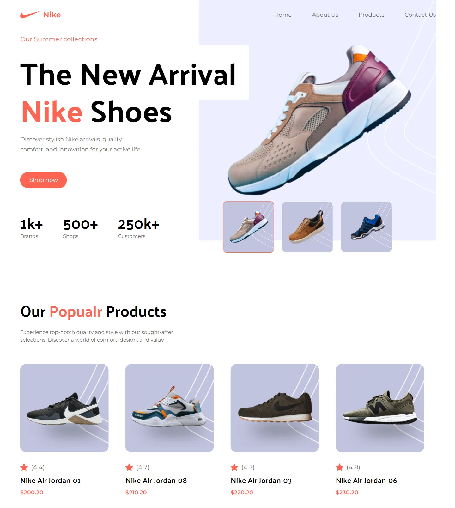

# 👟 Nike

### :page_facing_up: About

This project is a simple landing page for a Nike shoe shop. It is fully responsive and showcases my skills in using **TailwindCSS** for styling. I created this project to improve my knowledge of TailwindCSS and demonstrate my ability to create modern and attractive web pages.

### :star2: Features

- Fully responsive design

- Built with **React** and **TailwindCSS**

### :clapper: Live Demo

You can view a live demo of this project **[Here](nike-wrry.netlify.app)**  ➡️ To load faster please connect your VPN and then see the live demo.

### :computer: Installation

1. Clone the repository. `git clone https://github.com/weryamajidi/Nike`

2. In the terminal run `npm install` to install all dependencies.

:writing_hand: P.S: For commits, I've used **gitmoji**. For a better understanding use case of the **gitmoji** see [**Here**](https://github.com/carloscuesta/gitmoji)
